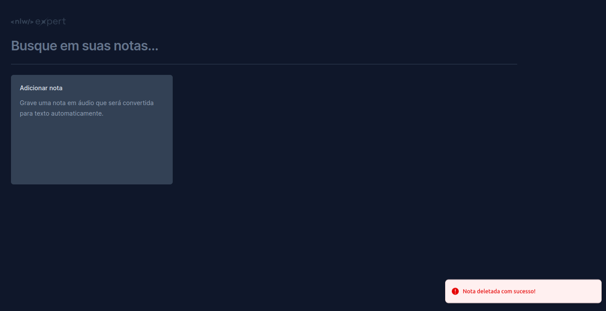

# React + TypeScript + Vite

# Aplicativo de notas

## Visão Geral
Este é o aplicativo de notas desenvolvido durante o evento NLW EXPERT da Rocktseat. Ele permite aos usuários criar notas digitando ou gravando áudio. As notas podem ser editadas e excluídas conforme necessário. Além disso, há a funcionalidade de busca, que permite ao usuário encontrar uma nota específica digitando uma palavra-chave.

## Funcionalidades
- Criação de notas por texto ou áudio.
- Edição e exclusão de notas.
- Renderização de notas criadas.
- Busca por palavra-chave na lista de notas.
- Utilização de modais para interação com o usuário.
- Exibição de datas formatadas.
- Feedback visual por meio de toasts.

## Tecnologias Utilizadas
- [React](https://reactjs.org/) - Biblioteca JavaScript para construção de interfaces de usuário.
- [Tailwind CSS](https://tailwindcss.com/) - Framework de estilo utilitário.
- [TypeScript](https://www.typescriptlang.org/) - Superset do JavaScript para adição de tipos.
- [Radix UI](https://radix-ui.com/) - Biblioteca para criação de modais.
- [date-fns](https://date-fns.org/) - Biblioteca para manipulação de datas.
- [Sonner](https://github.com/eckdanny/sonner) - Biblioteca para exibição de toasts.
- [SpeechRecognition API](https://developer.mozilla.org/en-US/docs/Web/API/SpeechRecognition) - API para transcrição de áudio em texto.
- [LocalStorage](https://developer.mozilla.org/en-US/docs/Web/API/Window/localStorage) - API para armazenamento local de dados.

## Como Executar
1. Clone este repositório.
2. Instale as dependências usando `npm install`.
3. Execute o aplicativo com `npm run dev`.
4. Acesse o aplicativo em seu navegador em `http://localhost:3000`.

## Contribuição
Contribuições são bem-vindas! Sinta-se à vontade para abrir um problema ou enviar um pull request.

## Licença
Este projeto está licenciado sob a licença MIT. Consulte o arquivo [LICENSE](LICENSE) para obter mais detalhes.

